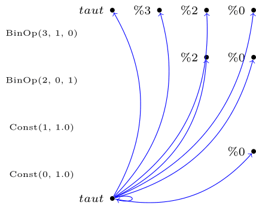

# Funky [](https://travis-ci.org/kper/funky)

Funky is a wasm interpreter. This project is an assignment for the Lehrveranstaltung Abstrakte Maschinen. It will not support module-loading and wat files.

The focus of this implementation is not performance but the general ability to execute arbitrary wasm code.

You will find the parser for parsing the binary wasm files in the folder `wasm-parser`. The logic for the runtime and execution will be in the `src` folder. The code for validating the AST is in the `validation` folder.

In addition, I am working on static taint analysis for webassembly. This means you can see which variables have the same value without executing the code.

## Taint Analysis

In this video, you can see how variables are tainted (the first parameter of the tuple is the destination). What you cannot see is that the taints will be also propagated to the called functions. For example the register `%9` is a parameter of function `0`. The result register `%10`, however, was not propagated later. Therefore, the value in `%9` was overwritten with another value in the function `0`.

[](https://asciinema.org/a/iRf8YzWUwip1GaVyNMSaSI3s6)

### Tabulation

Tabulation is the process of calculating the `same-level-realizable-paths`. The `ifds` supports multiple algorithms.



- No tabulation (graph-reachability will be solved with breadth-first-search)
- Original (Reps 1995 https://research.cs.wisc.edu/wpis/papers/popl95.pdf)
- Fast (Naeem et. al https://plg.uwaterloo.ca/~olhotak/pubs/cc10.pdf) 
- Sparse (He et. al https://dl.acm.org/doi/abs/10.1109/ASE.2019.00034)

## Building

Due to a error in cargo, it is not possible to build the taint checker from the root directory. Please go the folder `idfs` and execute `cargo build` again.

## Usage

### funky

```
./funky <input> <function> [<args>...] [--stage0 | --stage1] [--spec]
./funky (-h | --help)
./funky --version
```

### ifds

```
USAGE:
    ifds <SUBCOMMAND>

FLAGS:
    -h, --help       Prints help information
    -V, --version    Prints version information

SUBCOMMANDS:
    help     Prints this message or the help of the given subcommand(s)
    ir       
    naive    
    orig     
    repl     
    run      
    tikz     
    ui 
```

## Run it

### funky

```
cargo run --bin funky -- ./testsuite/block.0.wasm "break-bare"
```

## Run the debugger

```
cargo run --bin hustensaft -- ./testsuite/block.0.wasm "break-bare"
```

## Wait, there is more

You will find a custom debugger in `debugger` and the taint analysis in the `ifds` folder.

## Current spec coverage

Run `./spec_test.sh` to run the webassembly's specsuite. The current spec test coverage is $83%$.

~~~
Statistic {
    file: "select.wast",
    failed: 0,
    succeeded: 89,
    skipped: 0,
    total: 111,
    failed_case: None,
}
Statistic {
    file: "f64.wast",
    failed: 0,
    succeeded: 2501,
    skipped: 0,
    total: 2512,
    failed_case: None,
}
Statistic {
    file: "unwind.wast",
    failed: 0,
    succeeded: 42,
    skipped: 0,
    total: 50,
    failed_case: None,
}
Statistic {
    file: "elem.wast",
    failed: 0,
    succeeded: 24,
    skipped: 0,
    total: 55,
    failed_case: None,
}
Statistic {
    file: "align.wast",
    failed: 0,
    succeeded: 72,
    skipped: 0,
    total: 156,
    failed_case: None,
}
Statistic {
    file: "skip-stack-guard-page.wast",
    failed: 0,
    succeeded: 1,
    skipped: 0,
    total: 11,
    failed_case: None,
}
Statistic {
    file: "store.wast",
    failed: 0,
    succeeded: 10,
    skipped: 0,
    total: 68,
    failed_case: None,
}
Statistic {
    file: "local_tee.wast",
    failed: 0,
    succeeded: 56,
    skipped: 0,
    total: 97,
    failed_case: None,
}
Statistic {
    file: "br.wast",
    failed: 0,
    succeeded: 77,
    skipped: 0,
    total: 97,
    failed_case: None,
}
Statistic {
    file: "f32_cmp.wast",
    failed: 0,
    succeeded: 2401,
    skipped: 0,
    total: 2407,
    failed_case: None,
}
Statistic {
    file: "float_memory.wast",
    failed: 0,
    succeeded: 66,
    skipped: 0,
    total: 90,
    failed_case: None,
}
Statistic {
    file: "f32.wast",
    failed: 0,
    succeeded: 2501,
    skipped: 0,
    total: 2512,
    failed_case: None,
}
Statistic {
    file: "utf8-import-module.wast",
    failed: 0,
    succeeded: 0,
    skipped: 0,
    total: 176,
    failed_case: None,
}
Statistic {
    file: "float_literals.wast",
    failed: 0,
    succeeded: 85,
    skipped: 0,
    total: 161,
    failed_case: None,
}
Statistic {
    file: "utf8-invalid-encoding.wast",
    failed: 0,
    succeeded: 0,
    skipped: 0,
    total: 176,
    failed_case: None,
}
Statistic {
    file: "stack.wast",
    failed: 0,
    succeeded: 7,
    skipped: 0,
    total: 7,
    failed_case: None,
}
Statistic {
    file: "f64_bitwise.wast",
    failed: 0,
    succeeded: 361,
    skipped: 0,
    total: 364,
    failed_case: None,
}
Statistic {
    file: "br_table.wast",
    failed: 0,
    succeeded: 147,
    skipped: 0,
    total: 168,
    failed_case: None,
}
Statistic {
    file: "func.wast",
    failed: 0,
    succeeded: 96,
    skipped: 0,
    total: 167,
    failed_case: None,
}
Statistic {
    file: "comments.wast",
    failed: 0,
    succeeded: 4,
    skipped: 0,
    total: 4,
    failed_case: None,
}
Statistic {
    file: "unreachable.wast",
    failed: 0,
    succeeded: 6,
    skipped: 0,
    total: 64,
    failed_case: None,
}
Statistic {
    file: "fac.wast",
    failed: 0,
    succeeded: 7,
    skipped: 0,
    total: 8,
    failed_case: None,
}
Statistic {
    file: "token.wast",
    failed: 0,
    succeeded: 0,
    skipped: 0,
    total: 2,
    failed_case: None,
}
Statistic {
    file: "table.wast",
    failed: 0,
    succeeded: 7,
    skipped: 0,
    total: 19,
    failed_case: None,
}
Statistic {
    file: "const.wast",
    failed: 0,
    succeeded: 702,
    skipped: 0,
    total: 778,
    failed_case: None,
}
Statistic {
    file: "load.wast",
    failed: 0,
    succeeded: 38,
    skipped: 0,
    total: 97,
    failed_case: None,
}
Statistic {
    file: "memory_trap.wast",
    failed: 0,
    succeeded: 7,
    skipped: 0,
    total: 173,
    failed_case: None,
}
Statistic {
    file: "loop.wast",
    failed: 0,
    succeeded: 78,
    skipped: 0,
    total: 120,
    failed_case: None,
}
Statistic {
    file: "i32.wast",
    failed: 0,
    succeeded: 365,
    skipped: 0,
    total: 458,
    failed_case: None,
}
Statistic {
    file: "address.wast",
    failed: 10,
    succeeded: 200,
    skipped: 94,
    total: 260,
    failed_case: Some(
        FailedCommand {
            actuals: [],
            command: AssertReturn(
                AssertReturn {
                    line: 480,
                    action: Action {
                        module: None,
                        field: "32s_good5",
                        args: [
                            Argument {
                                ty: "i32",
                                value: "65504",
                            },
                        ],
                        ty: Invoke,
                    },
                    expected: [
                        Argument {
                            ty: "i64",
                            value: "0",
                        },
                    ],
                },
            ),
        },
    ),
}
Statistic {
    file: "memory_size.wast",
    failed: 0,
    succeeded: 40,
    skipped: 0,
    total: 42,
    failed_case: None,
}
Statistic {
    file: "left-to-right.wast",
    failed: 0,
    succeeded: 96,
    skipped: 0,
    total: 96,
    failed_case: None,
}
Statistic {
    file: "globals.wast",
    failed: 0,
    succeeded: 50,
    skipped: 0,
    total: 78,
    failed_case: None,
}
Statistic {
    file: "switch.wast",
    failed: 0,
    succeeded: 27,
    skipped: 0,
    total: 28,
    failed_case: None,
}
Statistic {
    file: "break-drop.wast",
    failed: 0,
    succeeded: 4,
    skipped: 0,
    total: 4,
    failed_case: None,
}
Statistic {
    file: "conversions.wast",
    failed: 0,
    succeeded: 523,
    skipped: 0,
    total: 615,
    failed_case: None,
}
Statistic {
    file: "imports.wast",
    failed: 0,
    succeeded: 1,
    skipped: 0,
    total: 149,
    failed_case: None,
}
Statistic {
    file: "linking.wast",
    failed: 0,
    succeeded: 0,
    skipped: 0,
    total: 118,
    failed_case: None,
}
Statistic {
    file: "names.wast",
    failed: 0,
    succeeded: 484,
    skipped: 0,
    total: 486,
    failed_case: None,
}
Statistic {
    file: "endianness.wast",
    failed: 0,
    succeeded: 69,
    skipped: 0,
    total: 69,
    failed_case: None,
}
Statistic {
    file: "traps.wast",
    failed: 0,
    succeeded: 4,
    skipped: 0,
    total: 36,
    failed_case: None,
}
Statistic {
    file: "br_if.wast",
    failed: 0,
    succeeded: 89,
    skipped: 0,
    total: 118,
    failed_case: None,
}
Statistic {
    file: "utf8-import-field.wast",
    failed: 0,
    succeeded: 0,
    skipped: 0,
    total: 176,
    failed_case: None,
}
Statistic {
    file: "i64.wast",
    failed: 0,
    succeeded: 375,
    skipped: 0,
    total: 414,
    failed_case: None,
}
Statistic {
    file: "local_get.wast",
    failed: 0,
    succeeded: 20,
    skipped: 0,
    total: 36,
    failed_case: None,
}
Statistic {
    file: "if.wast",
    failed: 0,
    succeeded: 123,
    skipped: 0,
    total: 239,
    failed_case: None,
}
Statistic {
    file: "float_misc.wast",
    failed: 0,
    succeeded: 441,
    skipped: 0,
    total: 441,
    failed_case: None,
}
Statistic {
    file: "local_set.wast",
    failed: 0,
    succeeded: 20,
    skipped: 0,
    total: 53,
    failed_case: None,
}
Statistic {
    file: "utf8-custom-section-id.wast",
    failed: 0,
    succeeded: 0,
    skipped: 0,
    total: 176,
    failed_case: None,
}
Statistic {
    file: "call.wast",
    failed: 0,
    succeeded: 70,
    skipped: 0,
    total: 91,
    failed_case: None,
}
Statistic {
    file: "f32_bitwise.wast",
    failed: 0,
    succeeded: 361,
    skipped: 0,
    total: 364,
    failed_case: None,
}
Statistic {
    file: "unreached-invalid.wast",
    failed: 0,
    succeeded: 0,
    skipped: 0,
    total: 111,
    failed_case: None,
}
Statistic {
    file: "memory.wast",
    failed: 0,
    succeeded: 55,
    skipped: 0,
    total: 79,
    failed_case: None,
}
Statistic {
    file: "float_exprs.wast",
    failed: 0,
    succeeded: 890,
    skipped: 0,
    total: 900,
    failed_case: None,
}
Statistic {
    file: "binary.wast",
    failed: 0,
    succeeded: 2,
    skipped: 0,
    total: 84,
    failed_case: None,
}
Statistic {
    file: "func_ptrs.wast",
    failed: 0,
    succeeded: 0,
    skipped: 0,
    total: 36,
    failed_case: None,
}
Statistic {
    file: "int_exprs.wast",
    failed: 0,
    succeeded: 94,
    skipped: 0,
    total: 108,
    failed_case: None,
}
Statistic {
    file: "inline-module.wast",
    failed: 0,
    succeeded: 1,
    skipped: 0,
    total: 1,
    failed_case: None,
}
Statistic {
    file: "exports.wast",
    failed: 0,
    succeeded: 11,
    skipped: 0,
    total: 82,
    failed_case: None,
}
Statistic {
    file: "int_literals.wast",
    failed: 0,
    succeeded: 31,
    skipped: 0,
    total: 51,
    failed_case: None,
}
Statistic {
    file: "labels.wast",
    failed: 0,
    succeeded: 26,
    skipped: 0,
    total: 29,
    failed_case: None,
}
Statistic {
    file: "typecheck.wast",
    failed: 0,
    succeeded: 0,
    skipped: 0,
    total: 164,
    failed_case: None,
}
Statistic {
    file: "return.wast",
    failed: 0,
    succeeded: 64,
    skipped: 0,
    total: 84,
    failed_case: None,
}
Statistic {
    file: "custom.wast",
    failed: 0,
    succeeded: 3,
    skipped: 0,
    total: 10,
    failed_case: None,
}
Statistic {
    file: "global.wast",
    failed: 0,
    succeeded: 50,
    skipped: 0,
    total: 81,
    failed_case: None,
}
Statistic {
    file: "forward.wast",
    failed: 0,
    succeeded: 5,
    skipped: 0,
    total: 5,
    failed_case: None,
}
Statistic {
    file: "f64_cmp.wast",
    failed: 0,
    succeeded: 2401,
    skipped: 0,
    total: 2407,
    failed_case: None,
}
Statistic {
    file: "type.wast",
    failed: 0,
    succeeded: 1,
    skipped: 0,
    total: 3,
    failed_case: None,
}
Statistic {
    file: "memory_redundancy.wast",
    failed: 0,
    succeeded: 5,
    skipped: 0,
    total: 8,
    failed_case: None,
}
Statistic {
    file: "memory_grow.wast",
    failed: 6,
    succeeded: 76,
    skipped: 55,
    total: 94,
    failed_case: Some(
        FailedCommand {
            actuals: [],
            command: AssertReturn(
                AssertReturn {
                    line: 97,
                    action: Action {
                        module: None,
                        field: "check-memory-zero",
                        args: [
                            Argument {
                                ty: "i32",
                                value: "327680",
                            },
                            Argument {
                                ty: "i32",
                                value: "393215",
                            },
                        ],
                        ty: Invoke,
                    },
                    expected: [
                        Argument {
                            ty: "i32",
                            value: "0",
                        },
                    ],
                },
            ),
        },
    ),
}
Statistic {
    file: "nop.wast",
    failed: 0,
    succeeded: 84,
    skipped: 0,
    total: 88,
    failed_case: None,
}
Statistic {
    file: "call_indirect.wast",
    failed: 0,
    succeeded: 108,
    skipped: 0,
    total: 156,
    failed_case: None,
}
Statistic {
    file: "block.wast",
    failed: 0,
    succeeded: 53,
    skipped: 0,
    total: 223,
    failed_case: None,
}
Statistic {
    file: "binary-leb128.wast",
    failed: 0,
    succeeded: 10,
    skipped: 0,
    total: 81,
    failed_case: None,
}
Statistic {
    file: "start.wast",
    failed: 0,
    succeeded: 8,
    skipped: 0,
    total: 20,
    failed_case: None,
}
Statistic {
    file: "data.wast",
    failed: 0,
    succeeded: 19,
    skipped: 0,
    total: 45,
    failed_case: None,
}
0.8310914776393508% total
~~~
